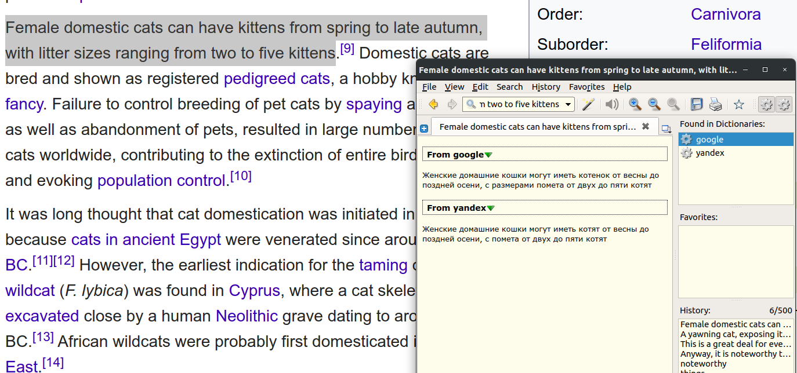

# Онлайн-словарь для Goldendict

## Описание функционала

Этот скрипт можно использовать как расширение для [Goldendict](http://goldendict.org/), позволяющее выполнять машинный онлайн-перевод от различных сервисов. В данный момент, скрипт умеет работать с сервисами: [translate.yandex](https://translate.yandex.ru/), [translate.google](https://translate.google.com/).  
Также, его можно использовать как консольный онлайн-переводчик.

## Установка

- [Goldendict](http://goldendict.org/) должен быть установлен в системе.  
- Python3 должен быть установлен в системе.

- Выполните команды:

  ```bash
  git clone https://github.com/nicko858/online_translate.git
  cd online_translate
  pip install -r requirements.txt
  ```

- Создайте файл `.env` в директории программы
- Создайте аккаунт в [yandex cloud](https://cloud.yandex.ru/docs/translate/)
- Получите [IAM-токен](https://cloud.yandex.ru/docs/iam/operations/iam-token/create), необходимый для аутентификации `yandex translate`  
- Получите [идентификатор](https://cloud.yandex.ru/docs/resource-manager/operations/folder/get-id) любого каталога, на который у вашего аккаунта есть роль `editor` или выше  
- Создайте следующую запись в `.env`- файле:  

  ```bash
  YANDEX_IAM_TOKEN=<ваш API-ключ>
  FOLDER_ID=<ваш folder_id>
  ```

## Настройка Goldendict

В интерфейсе программы `Goldendict`:

- *Edit --> Dictionaries --> Programs*  
  Добавьте записи со следующими параметрами:  
  1) `Type`: *Plain Text*  
     `Name`: *Yandex*  
     `Command Line` : `python3 <online_translate_path>/translator.py yandex %GDWORD%`
  2) `Type`: *Plain Text*  
     `Name`: *Google*  
     `Command Line` : `python3 <online_translate_path>/translator.py google %GDWORD%`  
, где:
     - *python3* - путь к интерпритатору python, или к виртуальному окружению
     - *<online_translate_path>* - директория куда склонирован `online_translate`  
- Нажмите *OK*
- *Edit --> Preferences --> Hotkeys*  
  Установите hotkey для перевода из буфера обмена (по умолчанию - `Ctrl+C+C`)
- Нажмите *OK*

## Использование

### Goldendict

Увидев незнакомую фразу/слово, просто выделите и нажмите `Ctrl+C+C`.  
Результат будет примерно следующий:  

  

### Консольный режим  

```bash

(venv) nicko@nicko-laptop:~/online_translate$ python translator.py yandex 'Female domestic cats can have kittens from spring to late autumn, with litter sizes ranging from two to five kittens'
Женские домашние кошки могут иметь котят от весны до поздней осени, с помета от двух до пяти котят

```
